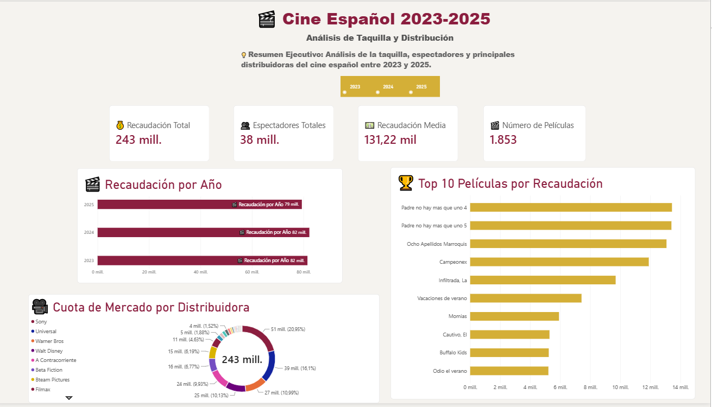
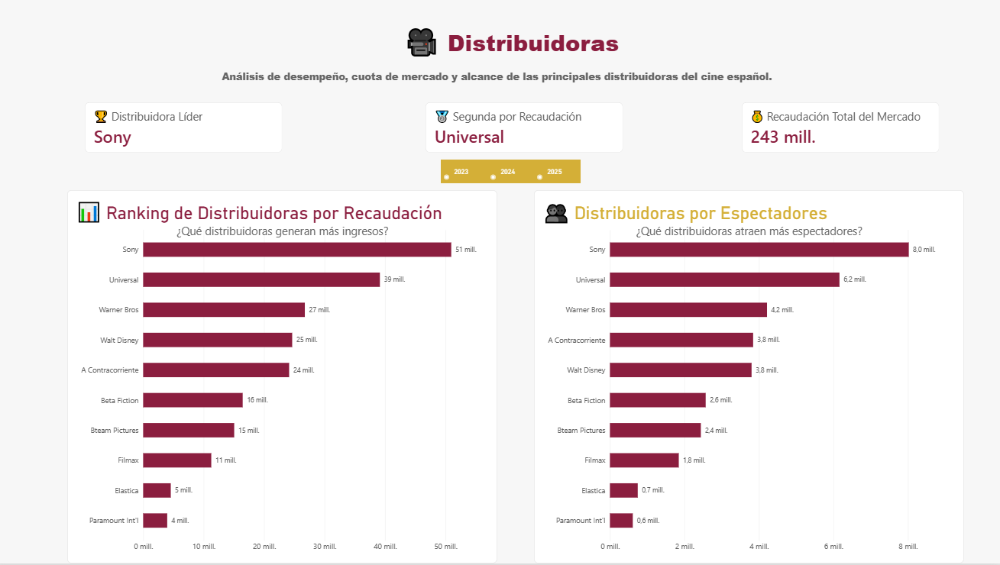
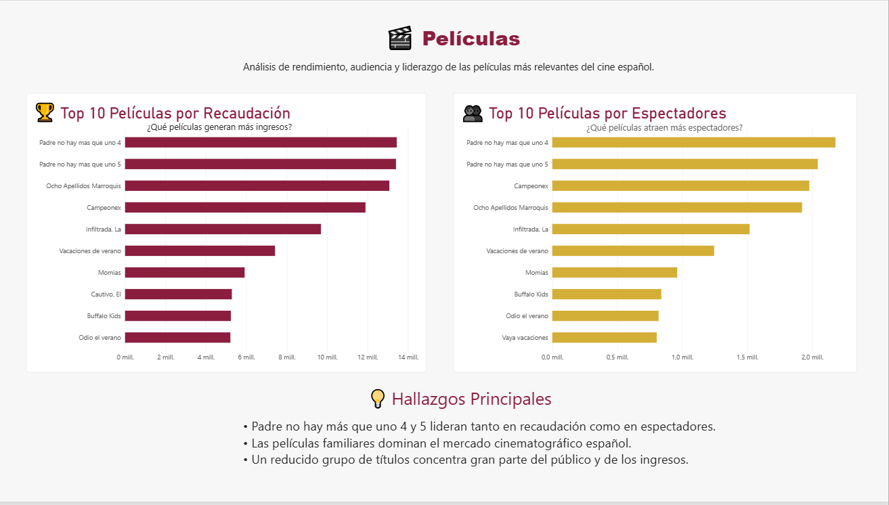
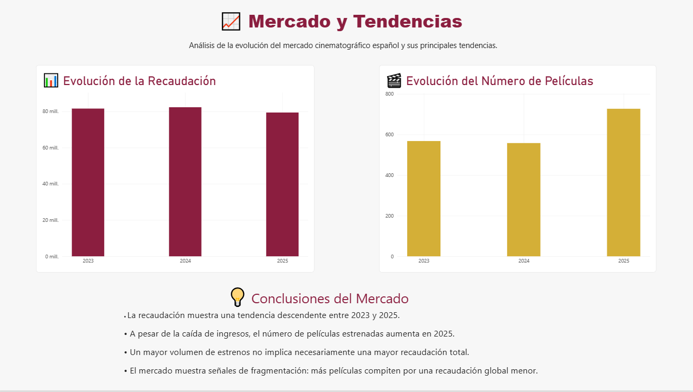
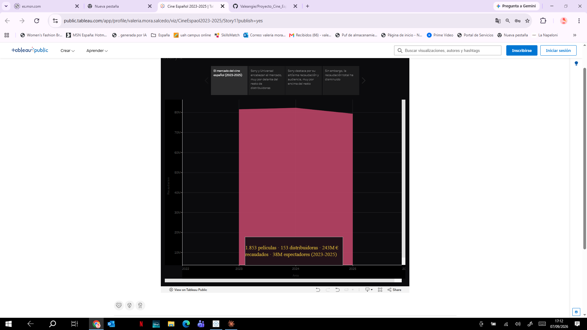
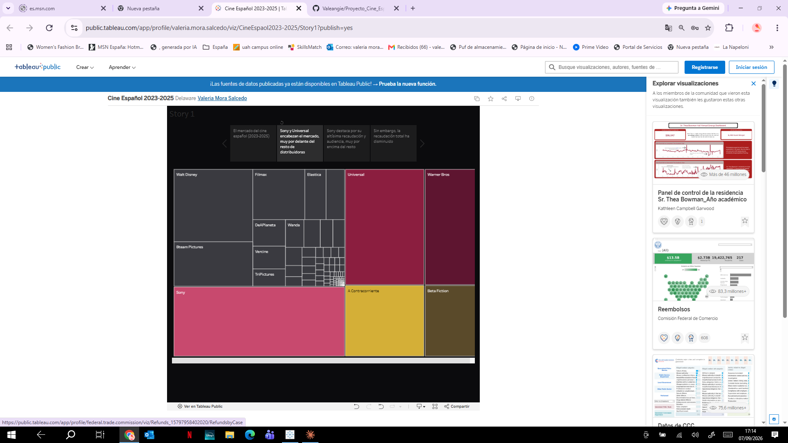
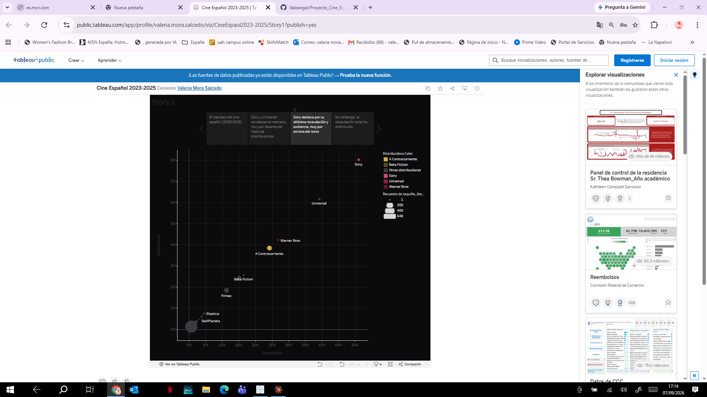
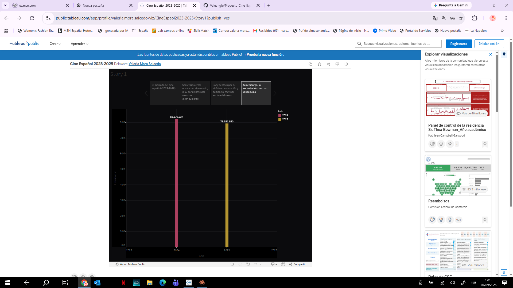

🎬 Análisis del Cine Español (2023-2025)

Proyecto de análisis de datos de taquilla del cine español, cubriendo el período 2023-2025. Incluye un pipeline completo desde la extracción de datos en PDF hasta un dashboard interactivo, pasando por limpieza de datos, base de datos SQL y análisis exploratorio en Python.

## 📊 Resumen del proyecto

A partir de los informes oficiales de taquilla en PDF, se construyó un dataset limpio y estructurado con **1.853 películas** y **153 distribuidoras**, que luego se analizó y visualizó para responder preguntas como:

- ¿Qué distribuidoras dominan el mercado del cine español?
- ¿Cómo ha evolucionado la recaudación y el número de espectadores año a año?
- ¿Cuáles son las películas más taquilleras del período?

**Cifras clave (2023-2025):**
- Recaudación total: **243 millones €**
- Espectadores totales: **38 millones**
- Recaudación media por película: **131.220 €**
- Distribuidora líder: **Sony Pictures**, con más de 50 millones € en recaudación acumulada

## 🛠️ Tecnologías utilizadas

- **Python** (Pandas, pdfplumber, Matplotlib) — extracción de datos desde PDF y análisis exploratorio
- **MySQL** — almacenamiento y consultas del dataset limpio
- **Power BI** — dashboard interactivo con 4 páginas de análisis
- **Tableau Public** — historia visual interactiva ("Story") con 4 puntos narrativos

## 📁 Estructura del proyecto

Proyecto_Cine_Espanol/
├── data/
│ ├── raw/taquilla/ # PDFs originales de taquilla (2023-2025)
│ └── processed/ # Dataset limpio (taquilla_limpia.csv)
├── notebooks/
│ └── analisis_taquilla_cine_espanol.ipynb # Pipeline completo + EDA
├── sql/
│ ├── 01_creacion_bd.sql # Creación de la base de datos
│ └── 02_consultas_basicas.sql # 15 consultas analíticas
├── visuals/ # Capturas del dashboard de Power BI y la historia de Tableau
└── Dashboard_Cine_Espanol_2023_2025.pbix

## 📈 Dashboard (Power BI)

### Resumen Ejecutivo

### Distribuidoras

### Películas

### Mercado y Tendencias

## 🎞️ Historia interactiva (Tableau Public)

Como complemento al dashboard de Power BI, construí una **Story** en Tableau Public que recorre los mismos datos con un enfoque más narrativo, pensada para contar el proyecto punto por punto.

🔗 **Ver la historia completa e interactiva:** [Cine Español 2023-2025 en Tableau Public](https://public.tableau.com/app/profile/valeria.mora.salcedo/viz/CineEspaol2023-2025/Story1)

**1. El mercado del cine español (2023-2025)**

**2. Sony y Universal encabezan el mercado**

**3. Sony destaca por su altísima recaudación y audiencia**

**4. Sin embargo, la recaudación total ha disminuido**

## 🔄 Cómo reproducir el proyecto

1. **Extracción y limpieza de datos**: ejecuta `notebooks/analisis_taquilla_cine_espanol.ipynb` para procesar los PDFs originales y generar `data/processed/taquilla_limpia.csv`.
2. **Base de datos**: crea la base de datos con `sql/01_creacion_bd.sql`, importa el CSV limpio a la tabla `peliculas`, y ejecuta las consultas de `sql/02_consultas_basicas.sql`.
3. **Dashboard**: abre `Dashboard_Cine_Espanol_2023_2025.pbix` en Power BI Desktop y actualiza el origen de datos.
4. **Historia interactiva**: explora la Story completa en [Tableau Public](https://public.tableau.com/app/profile/valeria.mora.salcedo/viz/CineEspaol2023-2025/Story1), sin necesidad de instalar nada.

## 👤 Autora

Valeria Mora
